# Laboratorio 10: Creación de una instancia de base de datos de Amazon RDS

## Tarea 1. Configurar una instancia de base de datos de RDS
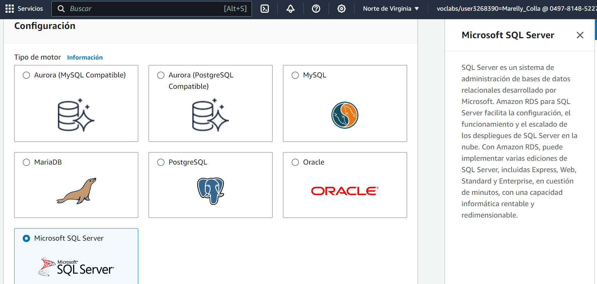

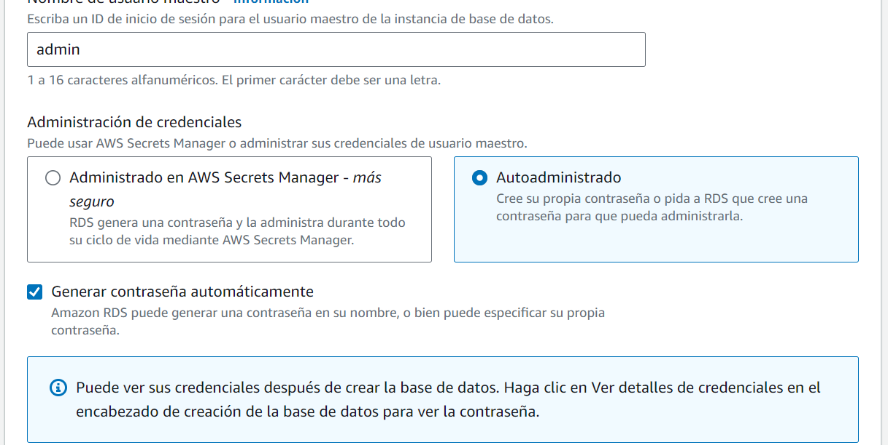

cluster
elastic cache

## Tarea 2. Descargar e instalar SQL Server Management Studio
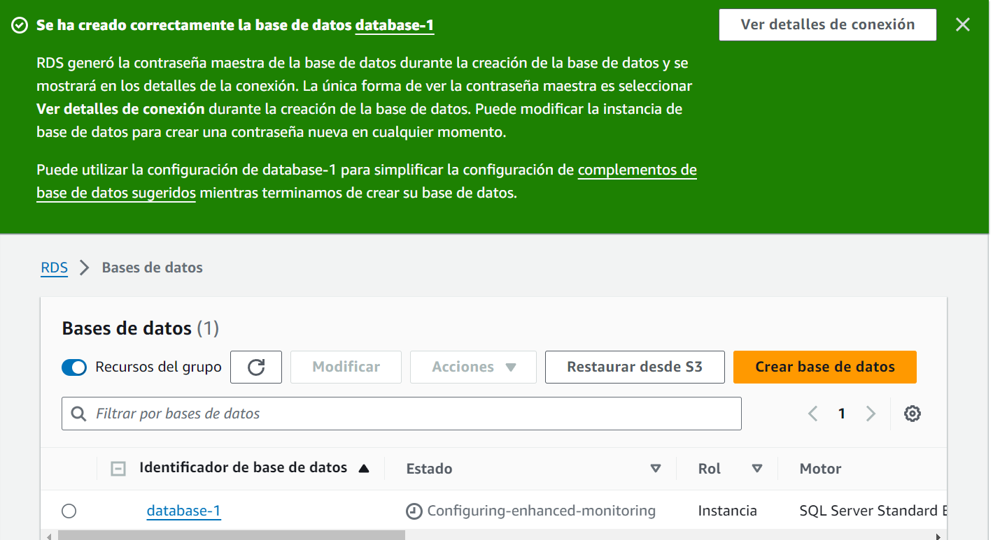

Microsoft SQL Server Management
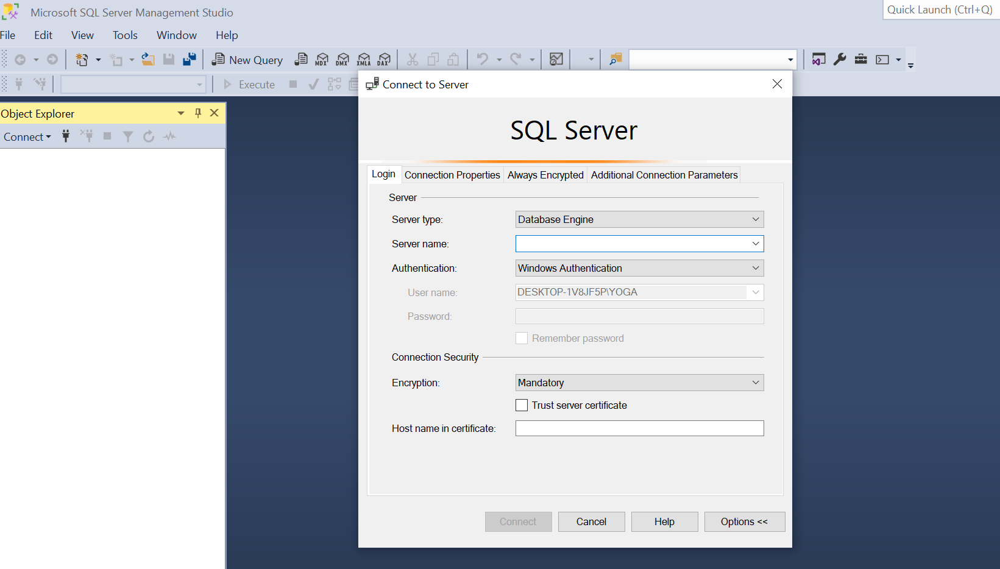

## Tarea 3. Hacer que la base de datos sea accesible públicamente
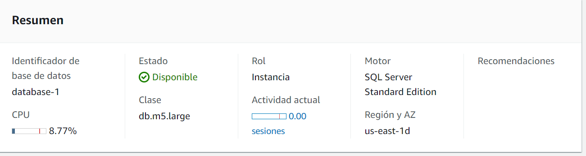
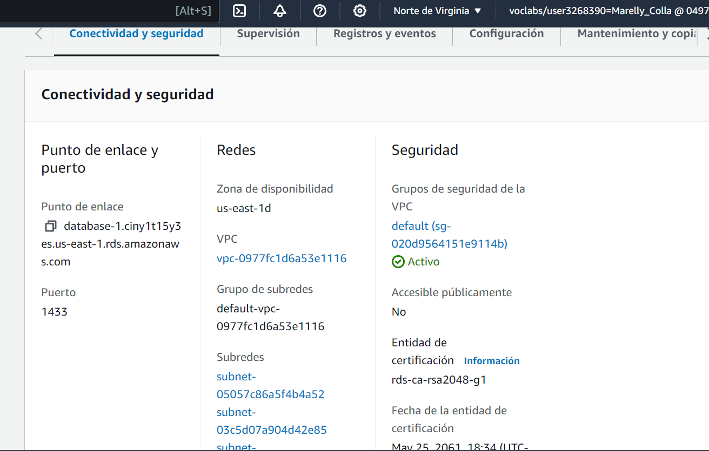
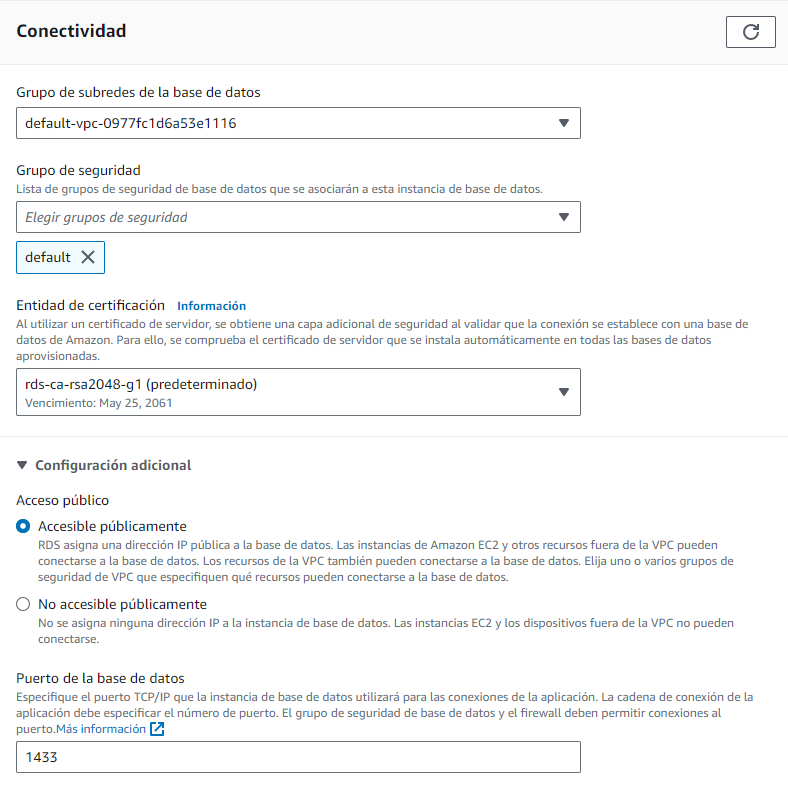
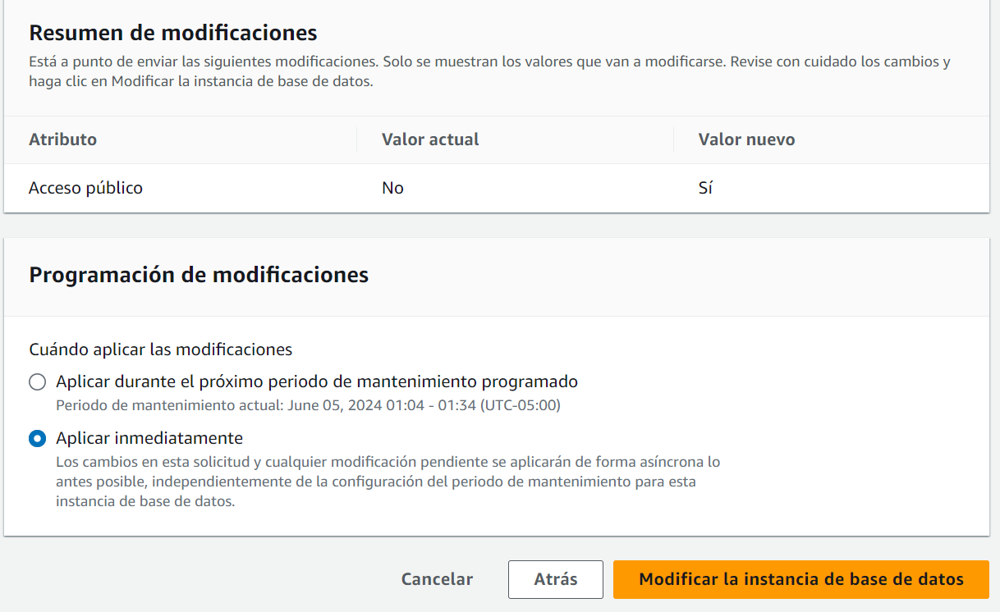

## Tarea 4. Actualizar tu grupo de seguridad de VPC
De manera predeterminada, el grupo de seguridad predeterminado de la VPC no permite el tráfico entrante de SQL Server desde fuentes externas. En esta tarea, activarás las conexiones entrantes de SQL Server desde tu dirección IP.

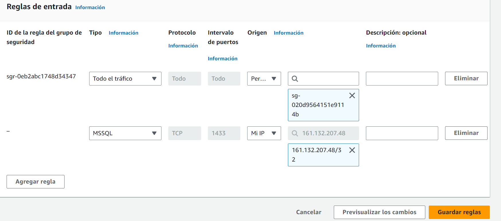

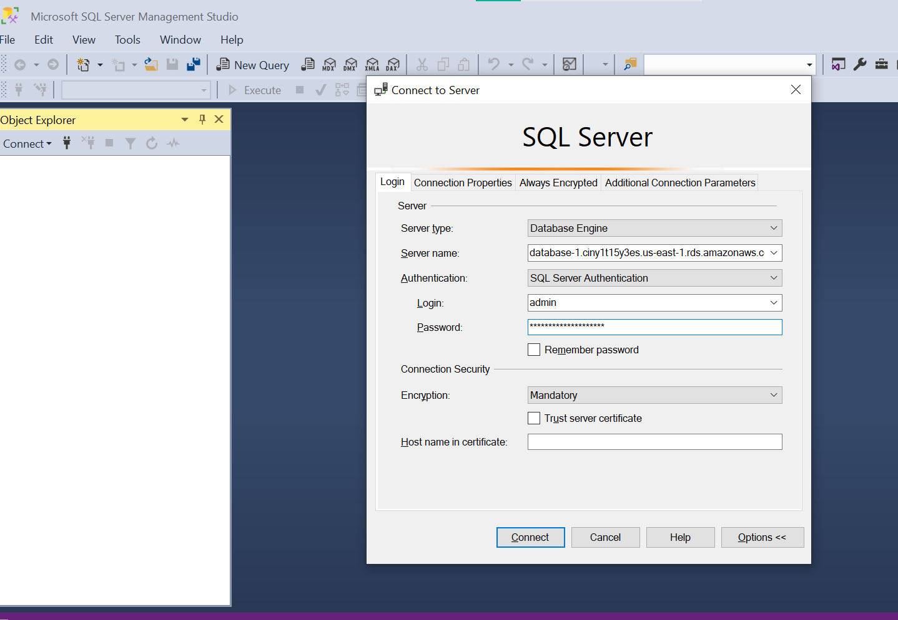

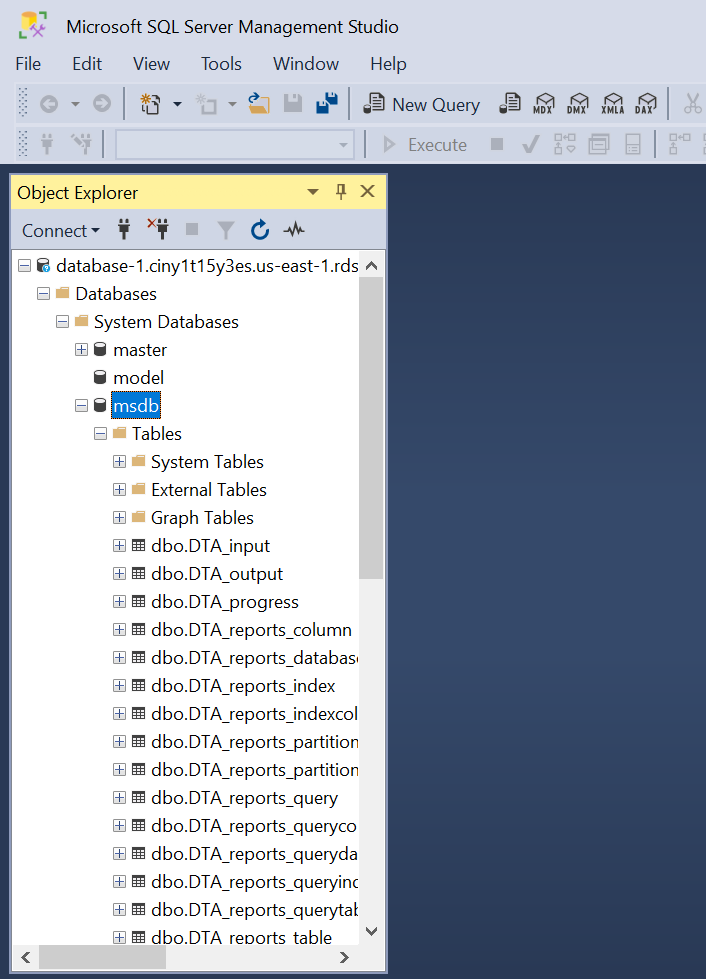
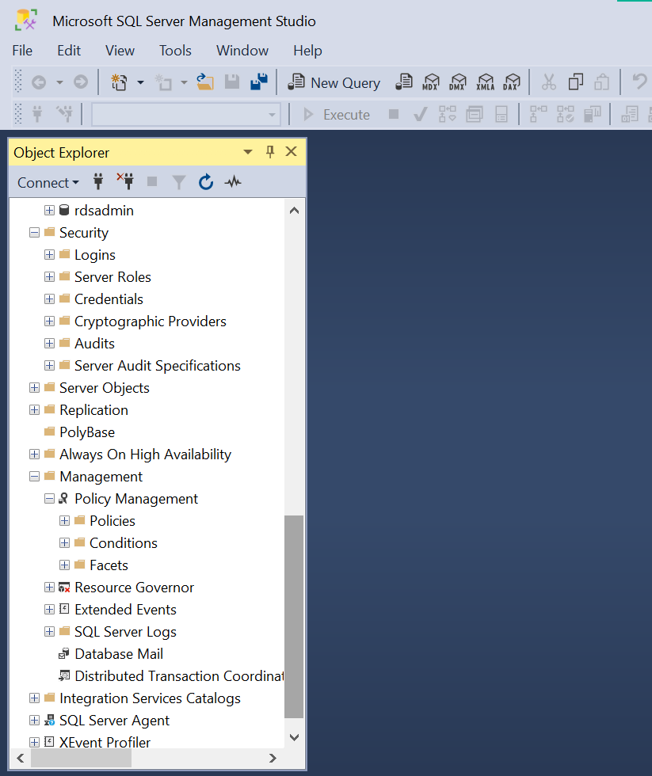

## Tarea 5. Conectarse a la instancia de base de datos

## Tarea 6. Explorar la estructura de la base de datos relacional