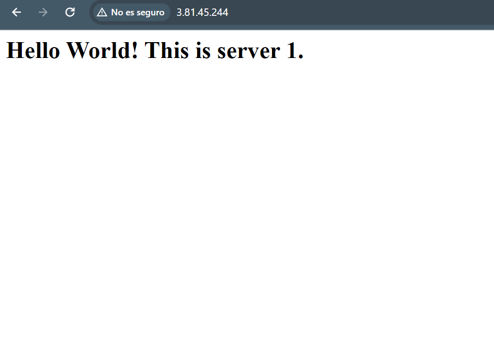

# Laboratorio 11: Balanceadores de carga

## Tarea 1. Lanzar una instancia de EC2

Configuración

## Tarea 2. Acceder al sitio web de la instancia de EC2

Zonas de disponibilidad: us-east-1a

## Tarea 3. Crear una segunda instancia de EC2 para el balanceo de carga

Crear instancia Web Server 2

## Tarea 4. Acceder al sitio web en la segunda instancia de EC2

Zonas de disponibilidad: us-east-1b

## Tarea 5. Crear un balanceador de carga

## Tarea 6. Probar el balanceador de carga

