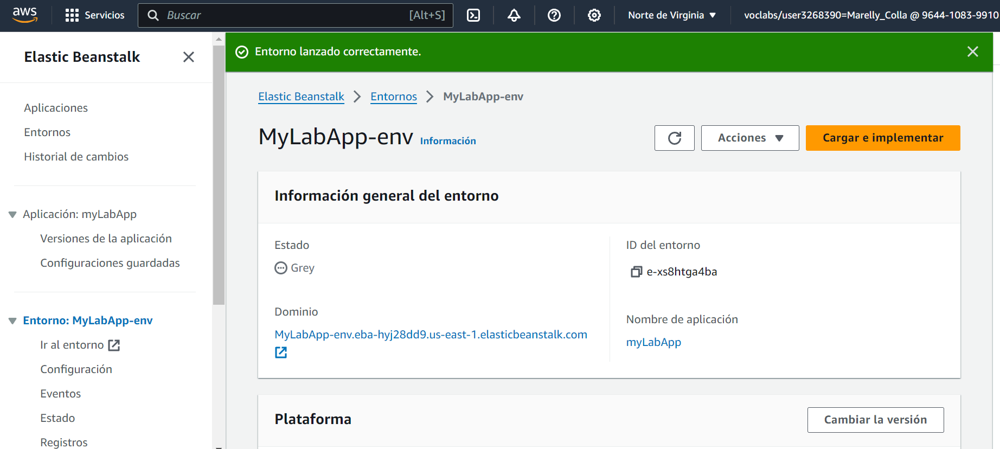
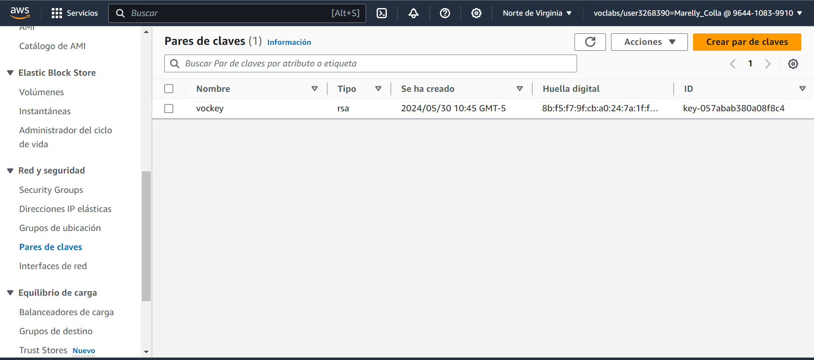

# Laboratorio 12: Uso de Elastic Beanstalk y CloudFormation

## Tarea 1. Implementar una aplicación mediante Elastic Beanstalk
Computación > Elastic Beanstalk > Crear aplicación

Grupos de seguridad

Elastic Beanstalk crea un bucket de almacenamiento de Amazon Simple Storage Service (Amazon S3) y un grupo de seguridad, lanza una instancia de Amazon Elastic Compute Cloud (Amazon EC2) y ejecuta el código.

Descargar archivo php.zip

## Tarea 2. Implementar una aplicación mediante CloudFormation

WordPress es un software web que puedes utilizar para crear un sitio web o blog. Esta plantilla instala una implementación de WordPress escalable y de alta disponibilidad con una instancia de base de datos Amazon Relational Database Service (Amazon RDS) para el almacenamiento.

