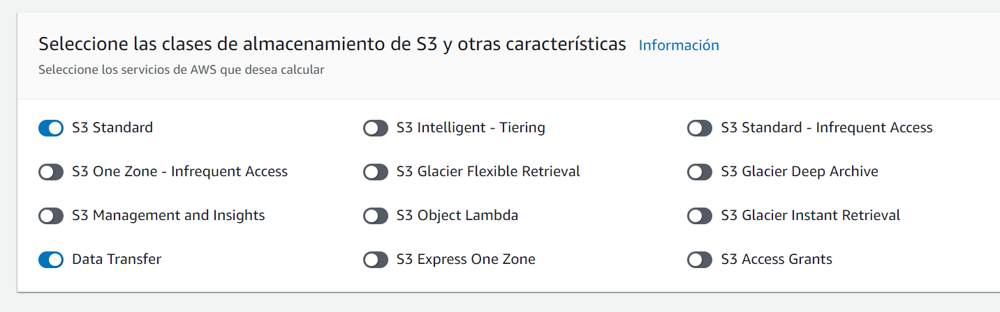

# Laboratorio 14: Calculadora de precios de AWS
En este laboratorio, utilizarás la Calculadora de precios de AWS para calcular el coste de utilizar Amazon Web Services (AWS).

Quieres ejecutar una instancia de Amazon Elastic Compute Cloud (Amazon EC2) durante una media de 8 horas al día, 7 días a la semana, en la región us-west-2. Quieres utilizar el tipo de instancia t2.medium, y no deseas pagar costes iniciales por la instancia.
También te gustaría almacenar 60 GB de datos en un bucket de Amazon Simple Storage Service (Amazon S3) en la región us-west-2 utilizando la clase de almacenamiento S3 Standard. Prevés que habrá unas 100 solicitudes mensuales de acceso a los datos desde internet.

## Ejecución

**Configurar Amazon EC2**

*Opciones de pago*

El Coste inicial es de 0,00 USD porque hemos elegido la opción de pago bajo demanda

**Configurar Amazon S3**

- Resumen

- Adición de compatibilidad
 El coste estimado del plan Basic Support ha añadido 0,00 USD a la estimación de costes total
 