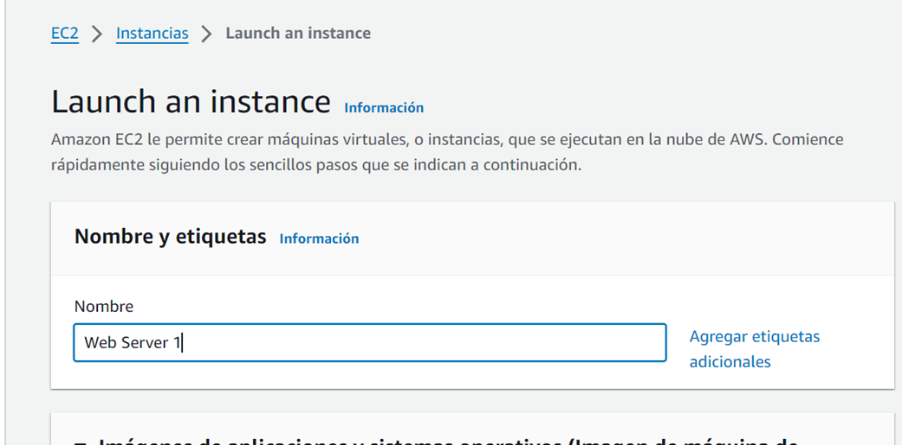
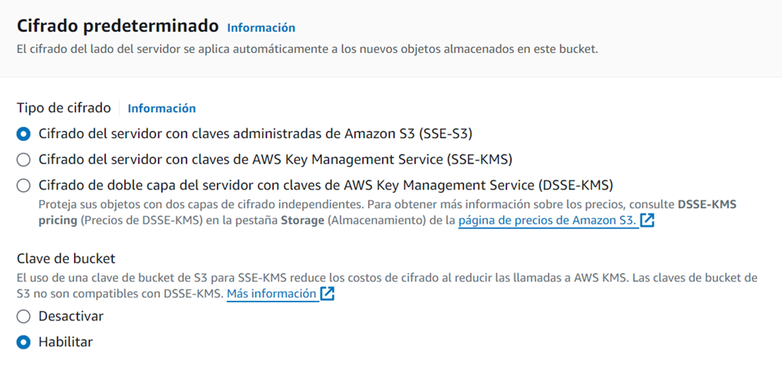

# Modulo 4: Servidores virtuales

# Laboratorio 1: Lanzamiento de una instancia de EC2

**Instancia de Amazon EC2**

## Tarea 1. Comenzar a crear la instancia y asignarle un nombre
Pasos para crear una instancia EC2
- Menu Servicios > Computación > EC2
- Lanzar Instancia > Lanzar instancia
- Asignarle nombre a la instancia



## Tarea 2. Imágenes de aplicación y SO

**AMI: Imagen de máquina de Amazon**
Es una plantilla que contiene la configuración de software (sistema operativo, servidor de aplicaciones y aplicaciones) necesaria para lanzar la instancia. 


## Tarea 3. Elegir el tipo de instancia
**Tipo de instancia:** Define los recursos de hardware asignados a la instancia. Cada tipo de instancia ofrece distintas características de computación, memoria y almacenamiento, y se agrupa en una familia de instancias en función de dichas características.


## Tarea 4. Seleccionar un par de claves
**Par de claves vockey**: Nos permite conectarnos a esta instancia mediante SSH después de que se haya iniciado. Aunque no tendrás que hacer eso en este laboratorio, sigue siendo necesario para identificar un par de claves existente, crear uno nuevo o al lanzar una instancia.


## Tarea 5. Configuración de red
La red indica la nube virtual privada (VPC) en la que quieres lanzar la instancia. Puede tener varias redes; por ejemplo, una para desarrollo, una segunda para pruebas y una tercera para producción.


**Firewall**


* Crear un nuevo grupo de seguridad
* Asignarle un nombre y descripción


Un grupo de seguridad actúa como un firewall virtual que controla el tráfico de una o varias instancias. Cuando inicias una instancia, la asocias a uno o varios grupos de seguridad. Añades reglas a cada grupo de seguridad que permiten que el tráfico fluya a sus instancias asociadas o desde ellas. Las reglas de un grupo de seguridad se pueden modificar en cualquier momento. Las nuevas reglas se aplican automáticamente a todas las instancias que estén asociadas al grupo de seguridad

## Tarea 6. Configurar el almacenamiento
Se inicia la instancia de Amazon EC2 usando un volumen predeterminado de disco de Elastic Block Store (EBS). Este será el volumen raíz (o volumen de arranque) que alojará el sistema operativo invitado. 

Se ejecutará en un disco duro SSD de uso general (gp2) de 8 GiB de tamaño. Se puede añadir más volúmenes de almacenamiento.

## Tarea 7: Detalles avanzados
Configurar un script que se ejecutará en la instancia cuando esta se inicie. El script no necesita permisos de usario raíz en el SO invitado de la instancia.


¿Qué hace? 1) Actualiza el servidor 2) Instala un servidor web Apache (httpd) 3) Configura el servidor web para que comience automáticamente durante el arranque 4) Activda el servidor web 5) Crea una página web

**Servidor web Apache**
Servidor web de código abierto que implementa el protocolo HTTP

## Tarea 8: Revisar la instancia y lanzarla 
- En ejecución = Se ha iniciado la instancia


- Una dirección pública significa que se puede acceder a la instancia desde Internet. Cada instancia que recibe una dirección IP pública también recibe un nombre de host DNS externo: por ejemplo, ec2-xxx-xxx-xxx-xxx.compute-1.amazonaws.com. 
- AWS resuelve un nombre de host DNS externo en la dirección IP pública de la instancia cuando la comunicación proviene de fuera de su VPC. Cuando la comunicación proviene de dentro de su VPC, el nombre de host DNS se resuelve en la dirección IPv4 privada.


## Tarea 9. Acceder a la instancia de EC2
No puedes acceder al servidor web porque el grupo de seguridad no permite el tráfico entrante en el puerto 80, que se utiliza para las solicitudes web HTTP.


## Tarea 10. Actualizar el grupo de seguridad
- Consola de administración de EC2 > Red y seguridad > Grupos de seguridad > Grupo de seguridad creado al lanzar la instancia > Reglas de entrada

## Tarea 11: Crear una regla de entrada
- Tipo: HTTP
- Fuente: Cualquier lugar-IPv4

La nueva regla HTTP de entrada crea una entrada para las direcciones IP IPv4 IP (0.0.0.0/0) y IPv6 (::/0).


## Tarea 12. Probar la regla


¿Cómo se usa otro puerto en AWS si el puerto 80 está ocupado?
- Red y Seguridad > Grupos de seguridad > Agregar reglas de entrada

# Laboratorio 2: S3
Un sitio web estático es fijo y muestra el mismo contenido para cada usuario. Por el contrario, un sitio web dinámico utiliza programación avanzada para proporcionar interacción con el usuario y mostrar contenido diferente según las selecciones del usuario.

## Tarea 1: Crear un bucket de S3
Pautas para crear el nombre del bucket
- Debe ser único entre todos los nombres de bucket existentes en Amazon S3.
- Solo debe contener caracteres en minúscula.
- Debe empezar por una letra o un número.
- Debe tener entre 3 y 63 caracteres.
- Después de crear el bucket, no podrás cambiar el nombre.
- Elige un nombre de bucket que refleje los objetos del bucket.Esto es así porque el nombre del bucket se ve en la dirección URL del sitio web que apunta a los objetos que vas a poner en el bucket.

Elegir Región de AWS donde residirá el bucket
- Elegir región más cercana para minimizar latencia y costos

**Bucket en S3**
- Bucket de uso general:
- Bucket de clases de uso de baja latencia:

## Tarea 2. Añadir una política de bucket para que el contenido esté disponible públicamente
- Política de bucket: Son reglas que definen el acceso y los permisos a los objetos almacenados en el bucket

- Permisos > Política de bucket > Editar 

```JSON
{
    "Version":"2012-10-17",
    "Statement": [
        {
            "Sid": "PublicReadGetObject",
            "Effect":"Allow",
            "Principal": "*",
            "Action":[
                "s3:GetObject"
            ],
            "Resource":[
                "arn:aws:s3:::nombre-bucket/*"
            ]
        }
    ]
}
```


## Tarea 3: Subir un documento HTML
En la consola seleccionar la pestaña Objetos
- Cargar > Añadir archivos > Abrir
- Propiedades --> Almacenamiento Estándar


## Tarea 4. Probar el sitio web
- Propiedades > Alojamiento de sitios web estáticos > Editar > Habilitar 
- Documento de índice [  index.html ]


**Listas de control de acceso - ACL**
    -ACL deshabilitadas: El propietario administra el acceso a los objetos del bucket través de políticas
    -ACL habilitadas: Permite definir permisos de acceso para cada objeto de forma individual

**Tipos de cifrado**
- SEE-S3 --> Por default. No necesita administrar claves
- SEE-KMS --> Claves de cifrado administradas por AWS KMS
- DSEE-KMS --> Combina los anteriores. Doble capa de segurida. Primero el objeto se cifra con SEE-S3, esta clave se cifra con otra clave de KMS

**AWS KMS: AWS Key Management Service**
- Permite crear y administrar claves criptográficas.
- Se puede integrar con otros servicios de AWS 
- Utiliza diferentes tipos de cifrado




