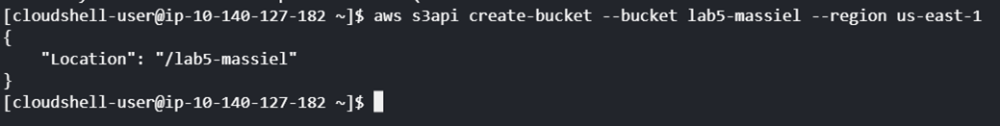
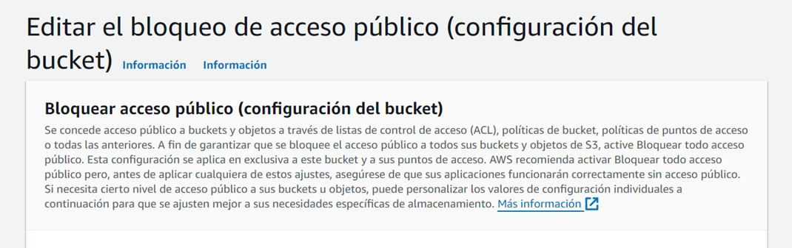
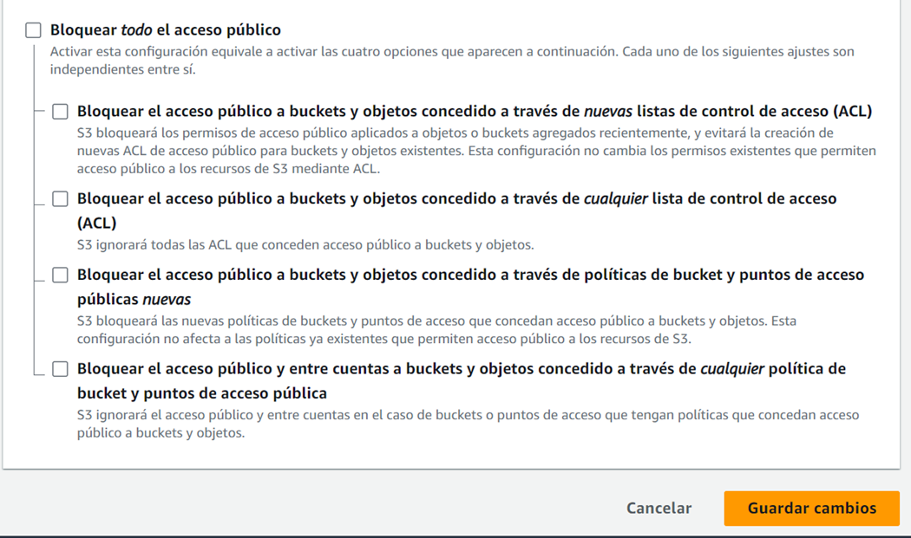
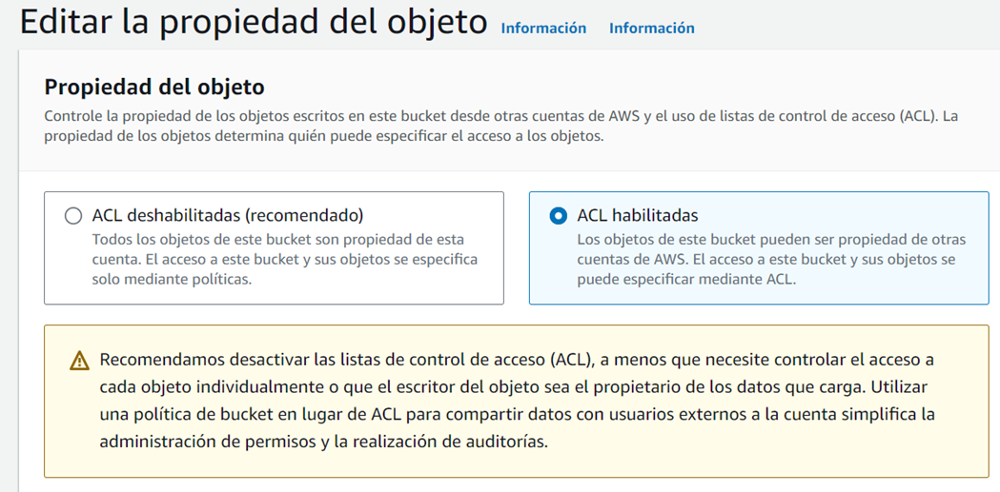
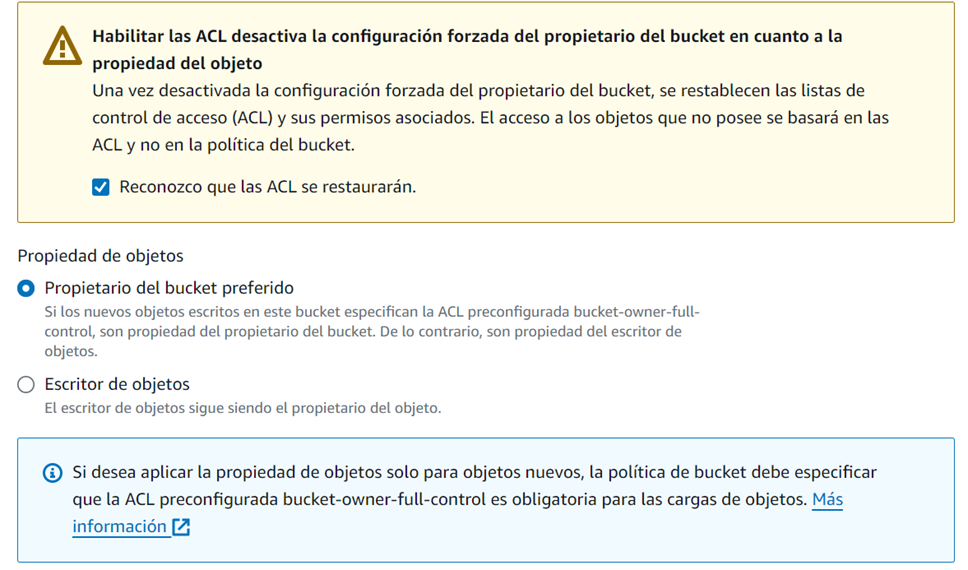
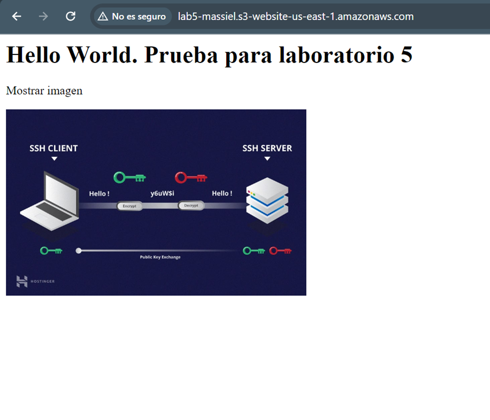
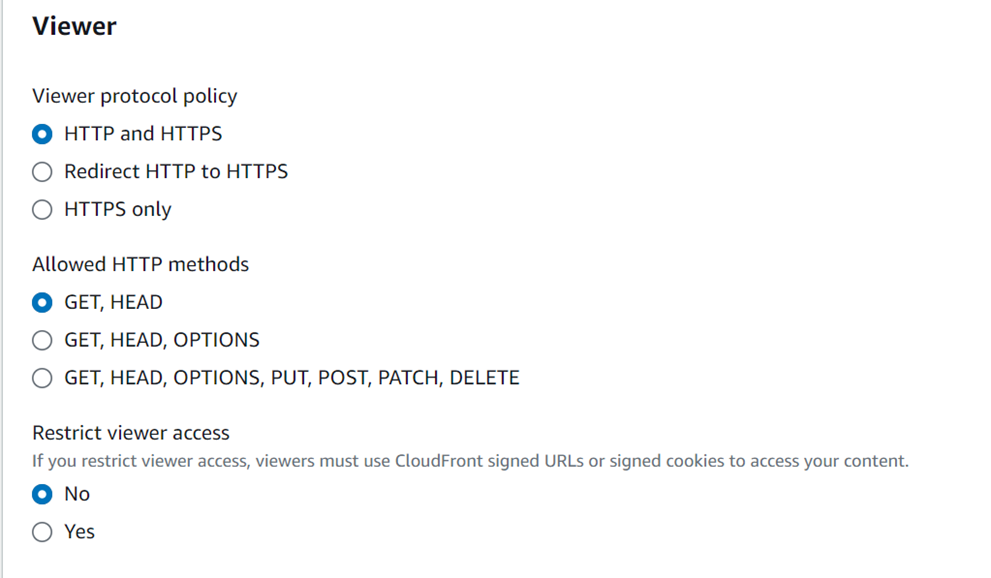
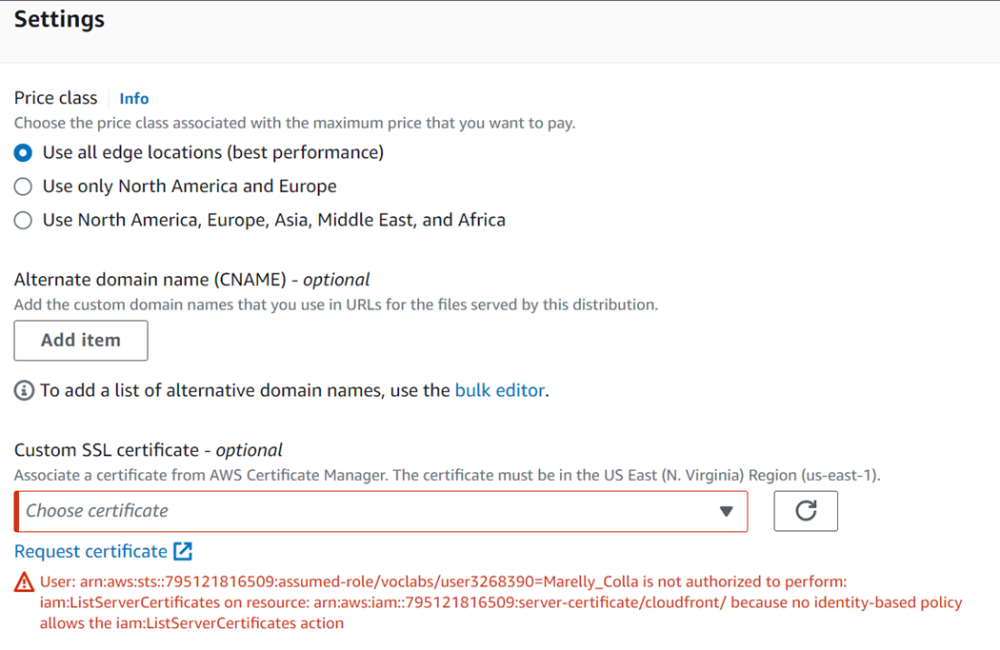
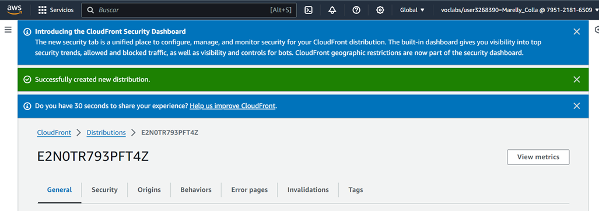
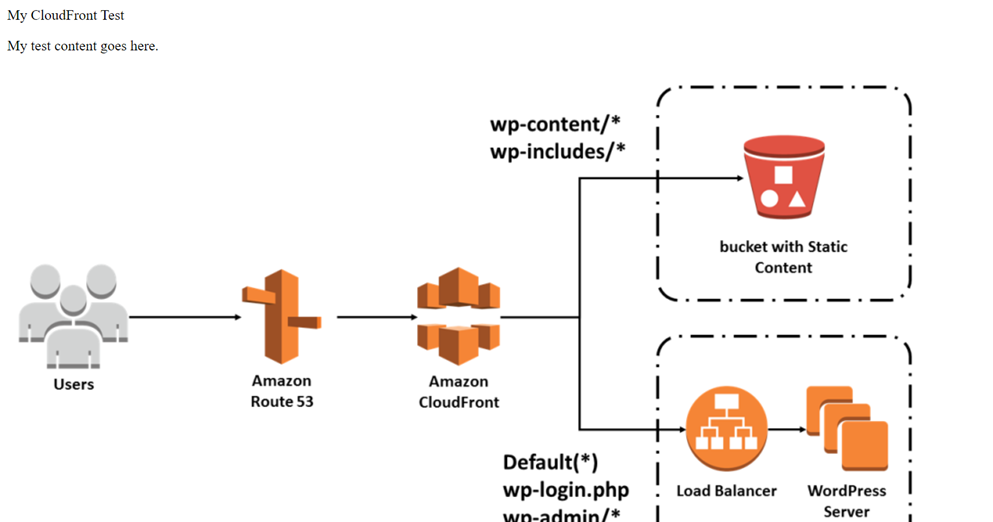

# Modulo 5: Entrega de contenido

# Laboratorio 5: Using CloudFront as a CDN for a Website
## Tarea 1. Crear un bucket de S3 mediante AWS CLI
- Servicios y herramientas para desarrolladores> CloudShell
AWS CloudShell es un shell basado en navegador que da acceso a la línea de comandos para los recursos de AWS en la región de AWS seleccionada.



## Tarea 2. Añadir una política de bucket
- Servicios > Almacenamiento > S3 > name_bucket > Permisos





- Propiedad del objeto > ACL habilitadas



- Políticas del bucket


## Tarea 3. Subir un documento HTML
- Objetos > Cargar archivo html
- Permisos de objeto > ACL predefinidas > Conceder acceso de lectura público

## Tarea 4. Probar el sitio web
- Propiedades > Alojamiento de sitios web estáticos > Editar > Habilitar > Documento de índice [ index.html ] 
- El link se encuentraa en la sección Alojamiento de sitios web estáticos > Punto de enlace de sitio web del bucket



## Tarea 5. Crear una distribución de CloudFront para servir al sitio web
-  Servicios > Redes y entrega de contenido > CloudFront
- Crear una distribución de CloudFront > sección Origen > seleccionar el punto de enlace del bucket S3



- HTTP y HTTPS deben estar seleccionados
- En Web Application Firewall (WAF), selecciona Do not enable security protections (No habilitar protecciones de seguridad).
- Crear distribución




Cuando el Estado sea Habilitado, puedes probar la distribución.

Prueba de la distribución con un archivo HTML y un objeto imagen, ambos deben tener habilitados el acceso público
```HTML
<html>
    <head>My CloudFront Test</head>
    <body>
        <p>My test content goes here.</p>
        <p>
    </body>
</html>
```
