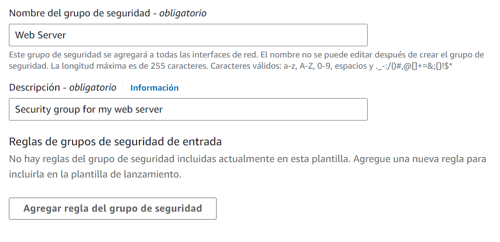
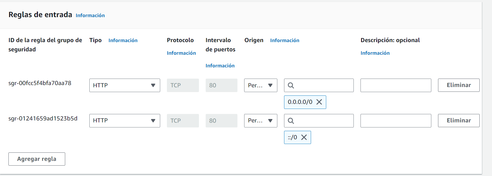
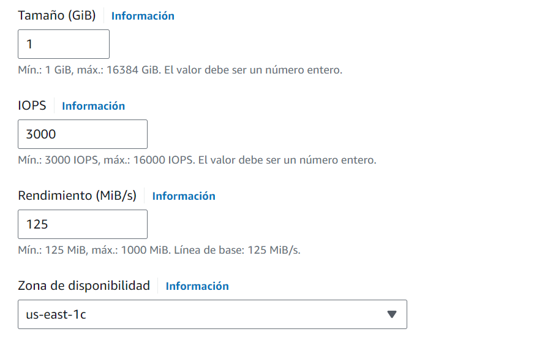

# LAB 6: Asociar un volumen de EBS

## Tarea 1. Comenzar a crear la instancia y asignarle un nombre
- Sevicios > Informática > EC2 > Lanzar instancia

## Tarea 2. Imágenes de aplicación y SO
El tipo de imagen de máquina de Amazon (AMI) que selecciones determina el sistema operativo (SO) que se ejecutará en la instancia de EC2 que inicies. En este caso, has seleccionado Amazon Linux 2023 como SO invitado.

## Tarea 3. Elegir el tipo de instancia
El Tipo de instancia define los recursos de hardware asignados a la instancia. Este tipo de instancia tiene 1 unidad de procesamiento central virtual (CPU) y 1 GiB de memoria.

## Tarea 4. Seleccionar un par de claves
El par de claves vockey que has seleccionado te permitirá conectarte a esta instancia mediante SSH después de que se haya iniciado.

## Tarea 5. Configuración de red

## Tarea 6. Configurar el almacenamiento

## Tarea 7: Detalles avanzados

## Tarea 8: Revisar la instancia y lanzarla

## Tarea 9. Acceder a la instancia de EC2

## Tarea 10. Actualizar el grupo de seguridad

## Tarea 11: Crear una regla de entrada

## Tarea 12. Probar la regla

## Tarea 13: Adjuntar un volumen de EBS a la instancia de EC2
El volumen de EBS tiene que estar en la misma zona de disponibilidad que la instancia EC2

- Zona de disponibilidad :us-east-1c

