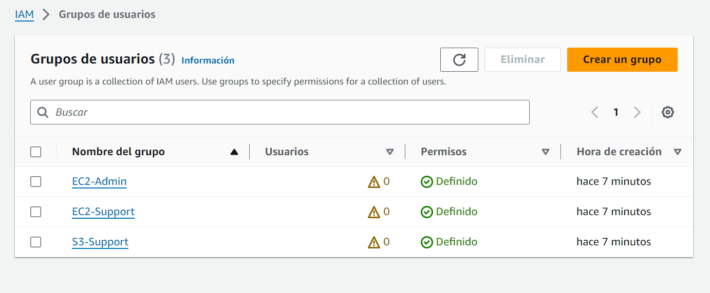

# Laboratorio 7: Introduction to IAM
## Tarea 1. Explorar usuarios y grupos
Región de la sesión: Norte de Virginia --> us-east-1

Contraseña de consola: Esto permite al usuario acceder a la consola de administración de AWS

### Grupo EC2-Support
Permisos
Hay asignada una política administrada: AmazonEC2ReadOnlyAccess

Una política define qué acciones están permitidas o denegadas para recursos concretos de AWS. Esta política concede permiso para Enumerar y Describir (ver) información sobre Amazon Elastic Compute Cloud (Amazon EC2), Elastic Load Balancing, Amazon CloudWatch y Amazon EC2 Auto Scaling

Los enunciados de una política de IAM tienen la siguiente estructura básica:

- **Efecto** nos indica si *Permitir* o *Denegar* los permisos.
- **Acción** especifica las llamadas a la API que se pueden realizar desde un servicio de AWS (por ejemplo, cloudwatch:ListMetrics).
- **Recurso** define el alcance de las entidades cubiertas por la regla de la política (por ejemplo, un bucket de Amazon Simple Storage Service [Amazon S3] o una instancia de Amazon EC2 específicos; un asterisco [*] significa cualquier recurso).

### Grupo S3-Support

### Grupo EC2-Admin
Política insertada: política asignada a un solo usuario o grupo. Las políticas insertadas, generalmente, se usan para asignar permisos en situaciones específicas.

Esta política concede permiso para Describir información acerca de instancias de Amazon EC2 y también la capacidad de Iniciar y Detener instancias.

### Escenario empresarial
Tu empresa utiliza los servicios de AWS cada vez más, y utiliza muchas instancias de Amazon EC2 y buckets de Amazon S3. Quieres dar acceso al nuevo personal según su función laboral, como se indica en la siguiente tabla:
|Usuario |En el grupo |Permisos|
|--------|------------|--------|
|user-1|S3-Support|Acceso de solo lectura a Amazon S3|
|user-2|EC2-Support|Acceso de solo lectura a Amazon EC2|
|user-3|EC2-Admin|Ver, iniciar y detener instancias de Amazon EC2|

## Tarea 2. Añadir usuarios a grupos

## Tarea 3. Iniciar sesión y probar usuarios
### Obtener la URL de inicio de sesión de la consola
Panel > URL de inicio de sesión para los usuarios de IAM

### Probar permisos de user-1
Comprobar el permiso para ver una lista de los buckets de Amazon S3 y su contenido.

No tiene permiso para ver las instancias EC2

### Probar permisos de user-2
El user2 solo puede ver instancias EC2 no tiene permiso para detenerlas

No tiene permiso para ver los buckets de S3

### Probar permisos de user-3
User 3 tiene permisos para detener una instancia EC2
