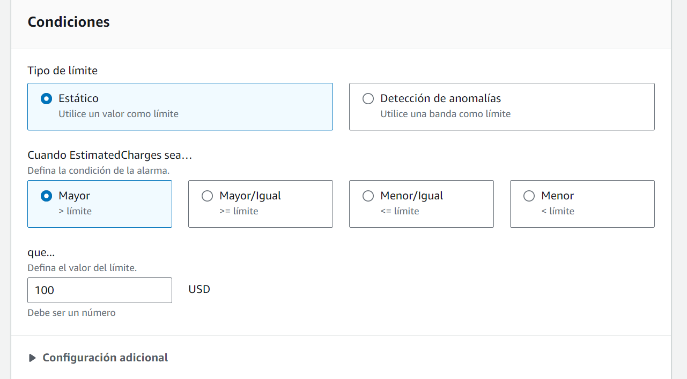
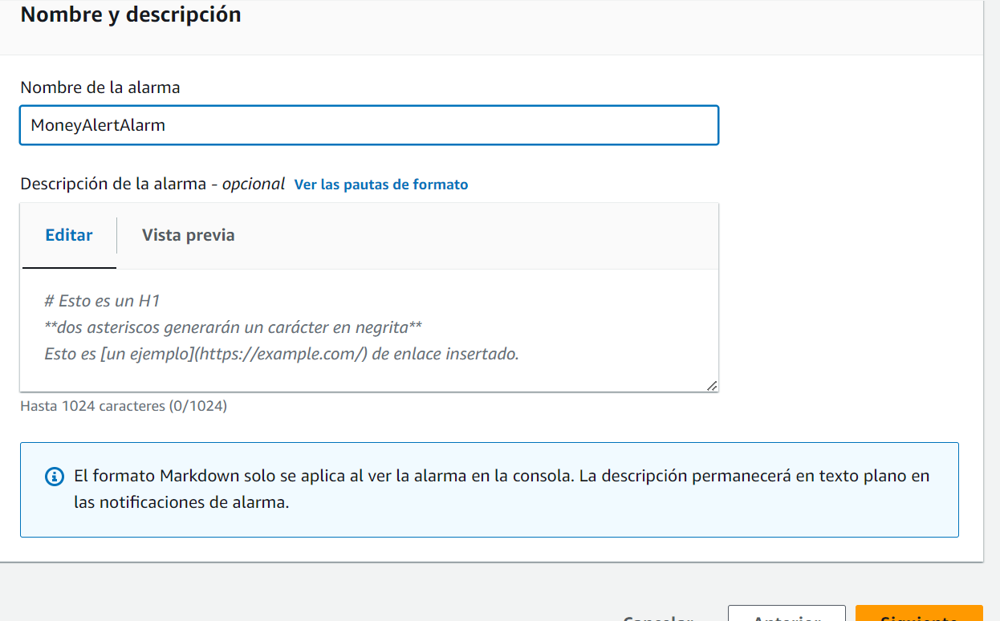

# Laboratorio 9: Creación de una alarma de CloudWatch que inicia un mensaje de Amazon SNS

## Tarea 1. Crear y suscribirse a un tema de SNS
Un tema actúa como un canal de comunicación donde se pueden publicar mensajes de alertas y eventos

Tipo:
1. FIFO: First-in First-out
2. Standard

Suscripción al tema

Confirmar suscripción

## Tarea 2. Crear una alarma de CloudWatch.

POP-UP: Ventana emergente
