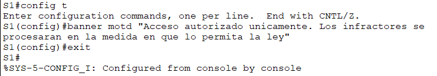

# **Actividad 2**
## 1. Configuración básica en el S1 

Verificar la configuración de contraseñas para el S1

**¿ Cómo puedes verificar que ambas contraseñas se hayan configurado correctamente?**
Con el comando "show running-config | include password" podemos confirmar que tanto la contraseña de consola como la de modo privilegiado sí están bien configuradas. 

**Aviso MOTD**

**Configuración en la NVRAM**

## 2. Configuración básica en el S2

## 3. Configuración de la PC1 y PC2
### Para PC1

### Para PC2

### Probar conectividad a los switches

**¿Tuviste éxito? Explica.**
No se tuvo éxito porque aún no hemos configurado las direcciones IP de los switches.

## 4. Configuración de la interfaz de administración  de switches

### Para S2

**¿Por qué debe introducir el comando no shutdown?**
Para activar la interfaz vlan 1

## Verificar la conectividad de la red
### PC1 con PC2

### PC1 con S1

### PC1 con S2

### S1 con PC1, PC2 y S2
