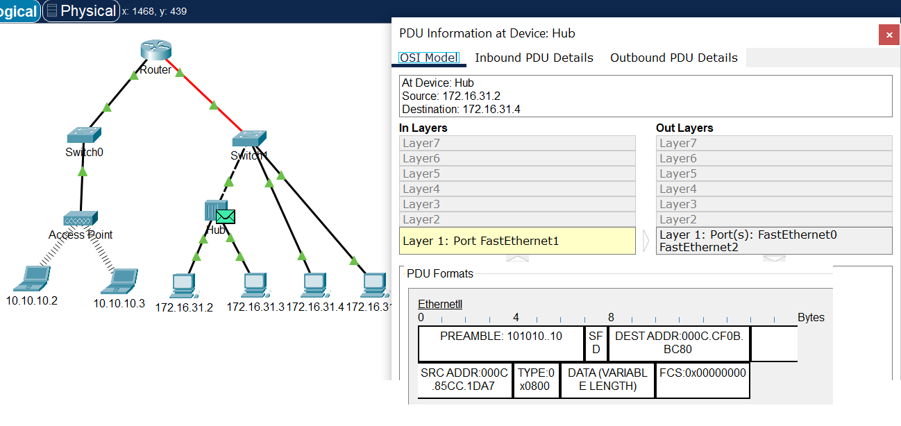

## **Actividad 3**
### Información de la PDU

* Ping de 172.16.31.2 a 172.16.31.4

**172.16.31.2**

**HUB**

**SWITCH**

**172.16.31.4**

+ Inbound PDU Details muestra los detalles de los PDU que están llegando al dispositivo desde otras fuentes de la red. 
+ Outbound PDU Details: Esta pestaña muestra los detalles de los PDU que están saliendo del dispositivo hacia otras partes de la red. 

* Ping de 172.16.31.5 a 10.10.10.2

**ROUTER**

**ACCESS POINT**

### Preguntas

### **1. ¿Se utilizaron diferentes tipos de cables / medios para conectar dispositivos?**
Si, se utilizó copper straight-through y serial DTE

### **2. ¿Los cables cambiaron el manejo de la PDU de alguna manera?**
No, los cables no afectan al manejo de PDU

### **3. ¿El hub perdió parte de la información que recibió?**
No

### **4.¿Qué hace el hub con las direcciones MAC y las direcciones IP?**
Nada, el hub solo reenvía el PDU a todos los dispositivos conectados a él

### **5. ¿El punto de acceso inalámbrico hizo algo con la información que se le entregó?**
El punto de acceso inalámbrico encapsula la información en un frame de wi-fi antes de transmitirlo por el aire.

### **6.¿Se perdió alguna dirección MAC o IP durante la transferencia inalámbrica?**
No

### **7. ¿Cuál fue la capa OSI más alta que utilizaron el hub y el punto de acceso?**
La capa 1 fue la más alta de OSI que utilizaron

### **8.¿El hub o el punto de acceso reprodujeron en algún momento una PDU rechazada con una “X” de color rojo?**
Si, esto ocurría cuando el hub reenviaba la información a todos los dispositivos. Todos los dispositivos que no fueran el de destino rechazaban el PDU.

### **9. Al examinar la ficha PDU Details (Detalles de PDU), ¿qué dirección MAC aparecía primero, la de origen o la de destino?**
Primero aparecía la de destino

### **10. ¿Por qué las direcciones MAC aparecen en este orden?**
Para que pueda reenviar la información a la de destino de forma más rápida. 

### **11. ¿Había un patrón para el direccionamiento MAC en la simulación?**
No.

### **12.¿Los switches reprodujeron en algún momento una PDU rechazada con una “X” de color rojo?**
No

### **13. Cada vez que se enviaba la PDU entre las redes 10 y 172, había un punto donde las direcciones MAC cambiaban repentinamente. ¿Dónde ocurrió eso?**
Sí, esto ocurría en el router

### **14. ¿Qué dispositivo usa direcciones MAC que comienzan con 00D0: BA?**
Sí, en el router hay uno

### **15. ¿A qué dispositivos pertenecían las otras direcciones MAC?**
Eran las direcciones MAC del destino y fuente.

### **16. ¿Las direcciones IPv4 de envío y recepción cambiaron los campos en alguna de las PDU?**
No

### **17. Cuando sigue la respuesta a un ping, a veces llamado pong, ¿ve el cambio de envío y recepción de direcciones IPv4?**
Sí, al seguir la respuesta a un ping, se puede observar el cambio de envío y recepción de direcciones IPv4.

### **18. ¿Cuál es el patrón para el direccionamiento IPv4 utilizado en esta simulación?**
El patrón para el direccionamiento IPv4 utilizado en esta simulación son: 10.10.10.2 / 24, 10.10.10.3 /24, 172.16.31.2 / 24, 172.16.31.3 / 24, 172.16.31.4 / 24, 172.16.31.5 / 24.

### **19. ¿Por qué es necesario asignar diferentes redes IP a los diferentes puertos de un router?**
Es necesario para segmentar el tráfico de red y mantener la seguridad al separar las comunicaciones de diferentes dispositivos o redes.

### **20. Si esta simulación se configura con IPv6 en lugar de IPv4, ¿cuál sería la diferencia?**
Si se configura con IPv6 en lugar de IPv4, la diferencia principal sería el uso de direcciones IPv6, que son mucho más largas