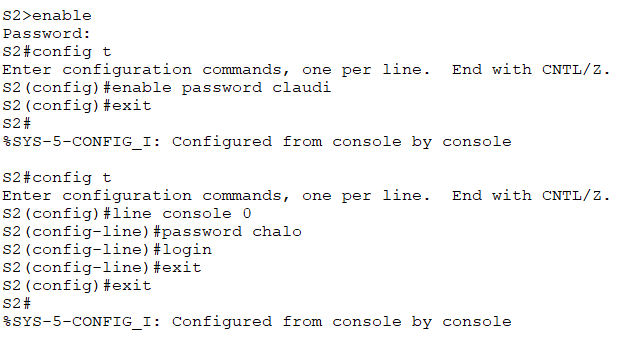

# **Actividad 4**
## 1. Configuración actual del switch
**a) ¿Cuántas interfaces Fast Ethernet tiene el switch?** 
Tiene 23

**b) ¿Cuántas interfaces Gigabit Ethernet tiene el switch?**
Tiene 2

**¿Cuál es el rango de valores que se muestra para las líneas vty?**
Yo veo 2 configuraciones de lineas vty uno con rango de 1 a 4 y el otro con rango del 5 al 15

**¿Qué comando muestra el contenido actual de la memoria de acceso aleatorio no volátil (NVRAM)?**
El comando **show star**

**¿Por qué el switch responde con "startup-config no está presente"?**
Porque todavia no se ha guardado ninguna configuración en el NVRAM

## 2. Configuración básica del switch

**¿Por qué se requiere el comando login?**
Se usa para habilitar la autenticación con contraseña

Configuración de la contraseña a modo privilegiado

Verificar las contraseñas

**¿Qué se muestra como contraseña de enable secret?**
Se muestra como varios letras y símbolos

**¿Por qué la contraseña de enable secret se ve diferente de lo que se configuró?**
Porque es una contraseña encriptada

Encriptar las contraseñas

**Si configuras más contraseñas en el switch, ¿se mostrarán como texto no cifrado o en forma cifrada en el archivo de configuración? Explica.**
El comando service password-encryption encripta tanto las contraseñas previamente configuradas como las contraseñas que se puedan configurar después.

## 3. Aviso MOTD

**¿Cuándo se muestra este aviso?**
Se muestra al principio, antes de pedir la contraseña de consola.

**¿Por qué todos los switches deben tener un aviso de MOTD?**
Es una forma de que todos los usuarios vean un determinado mensaje

## 4. Configuración en NVRAM

**¿Cuál es la versión abreviada más corta del comando copy running-config startup-config? Examine el archivo de configuración de inicio.¿Qué comando muestra el contenido de la NVRAM?**
La versión abreviada es **copy run start** y se puede ver a través del comando **show start**

**¿Todos los cambios realizados están grabados en el archivo**
Eso creo, no me muestra toda la configuración solo me muestra una versión resumida.

### Para S2

