# Actividad 6: Crear una red con un switch y un router - Modo Físico
## 1 . Configura la topología de red
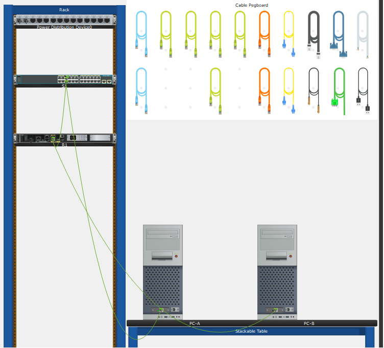

## 2. Configurar los dispositivos y verificar la conectividad

### Asignar direcciones IP estáticas a las PC
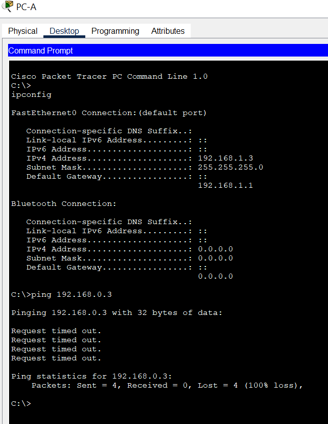

**¿Por qué los pings no fueron correctos?**
Porque aún no se han configurado ni el router ni el switch, y es a través de estos que se podrían comunicar la PC-A y la PC-B

### Configurar el router
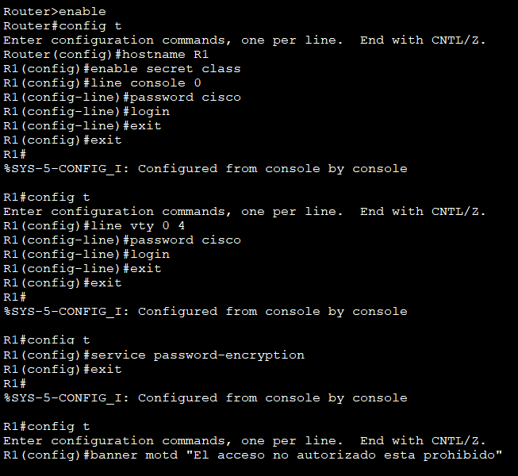

* Configura y activa las dos interfaces en el router.

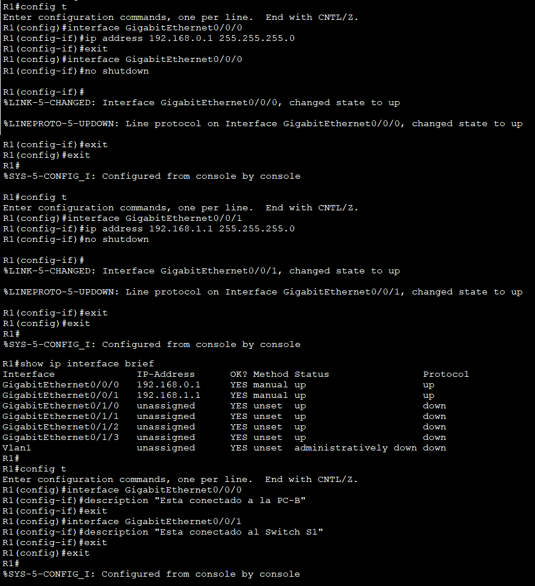

* Habilitar el enrutamiento IPv6, guardar configuración y configurar el reloj del router

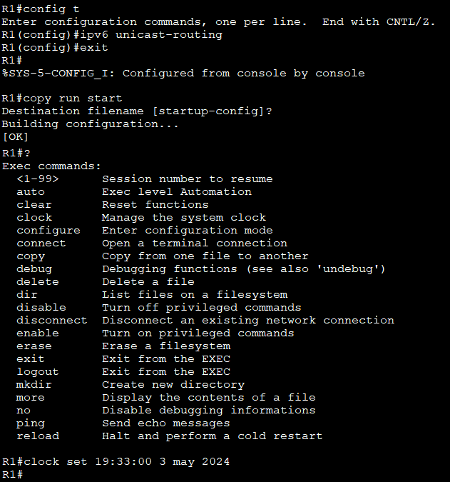

### Configurar el switch
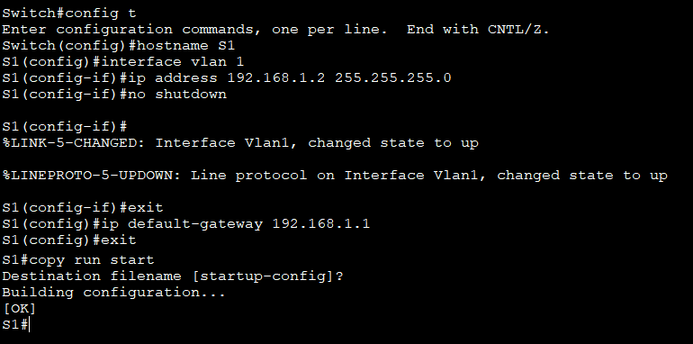

### Verificar la conectividad

* De PC-A ping a PC-B
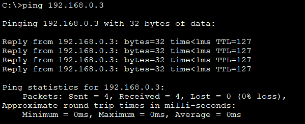

* De S1 a PC-B
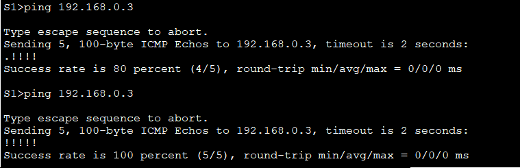

## 3. Muestra la información del dispositivo
### Muestra la tabla de routing en el router.
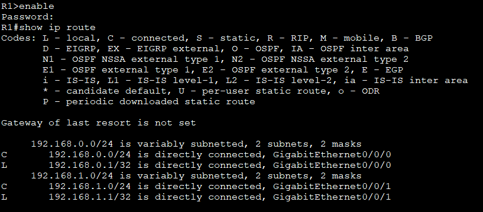

**¿Qué código se utiliza en la tabla de enrutamiento para indicar una red conectada directamente?**
Se usa la letra C

**¿Cuántas entradas de ruta están codificadas con un código C en la tabla de enrutamiento?**
Hay 2: 192.168.0.0 y 192.168.1.0

**¿Qué tipos de interfaces están asociadas a las rutas con código C?**
Están conectadas las interfaces GigabitEthernet0/0/0 y GigabitEthernet0/0/1

**Rutas IPv6**
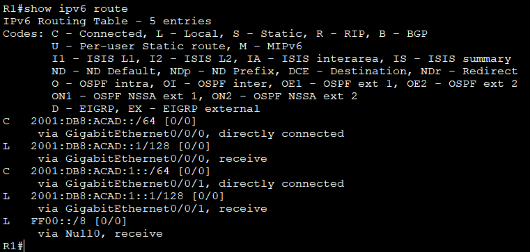

### Muestra la información de la interfaz en el R1.
* a) show interface g0/0/1
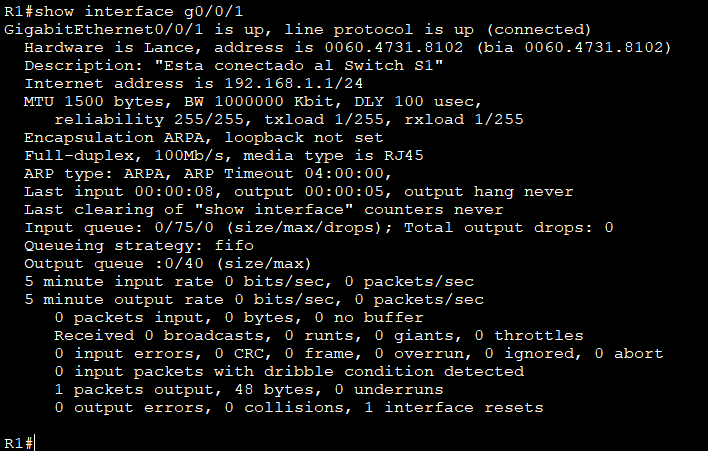

**¿Cuál es el estado operativo de la interfaz G0/0/1?**
La interfaz está activa, el protocolo de línea también está activo

**¿Cuál es la dirección de control de acceso a los medios (MAC) de la interfaz G0/0/1?**
Es 0060.4731.8102

**¿Cómo se muestra la dirección de Internet en este comando?**
Se muestra como 192.168.1.1/24 (dirección IPv4)

* b) show ipv6 interface interface 
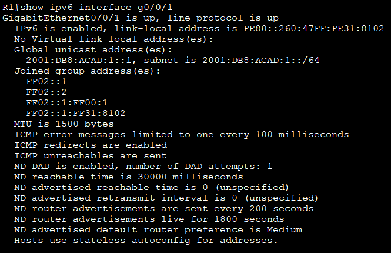

### Muestra una lista de resumen de las interfaces del router y del switch
* a) Comando show ip interface brief en R1
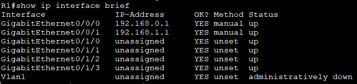

* b) Comando show ipv6 interface brief en R1 
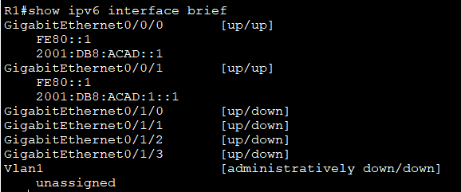

* c)  Comando show ip interface brief en S1.
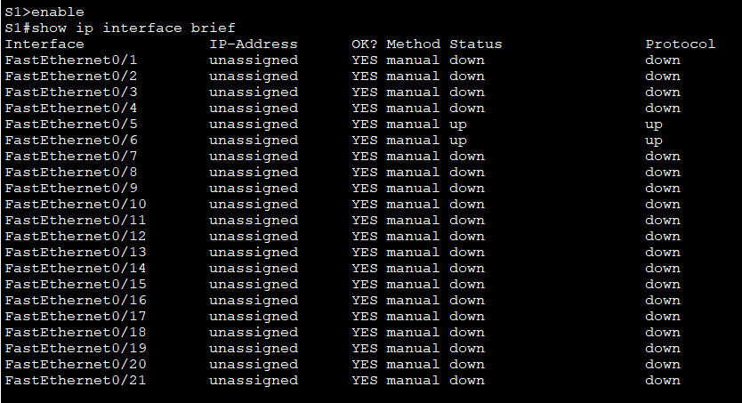

## Preguntas
**1. Si la interfaz G0/0/1 se mostrará administratively down, ¿qué comando de configuración de interfaz usaría para activar la interfaz?**
Usaría el comando ``no shutdown``

**2. ¿Qué ocurriría si hubiera configurado incorrectamente la interfaz G0/0/1 en el router con una dirección IP 192.168.1.2?**
No se podría enviar información a través del router