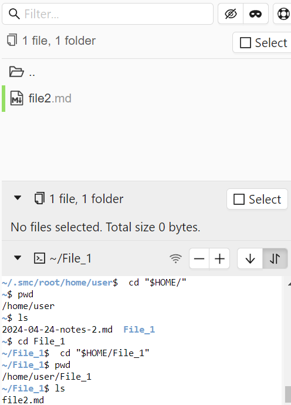

# Tarea de Linux
Ejecute los comandos en Colcac
# Navegación
## Pwd, cd, ls

## less
Programa que te muestra archivos de texto. Muestra 1 página a la vez. 

## file
Muestra el tipo de archivo para saber si podemos visualizarlo con less como: ASCII text, bash script, HTML

# Manipular archivos
mkdir < dir>: Crear directorios
touch < new.txt>: Crear archivos nuevos

**Caracteres especiales**
También llamados wildcards, se pueden usar en conjunto con otros comandos

|*| Coincide con cualquier carácter. Todos los archivos|
|?| Coindice con cualquier caracter. Especifica la cantidad|
|[char ] | Puede especificar el tipo de caracter|
|[!char ]| Cualquier caracter que NO incluya los que están en el conjunto char|

* cp "file1" "file2": Copiar un archivo file1 en un archivo file2. Si el 2 no existe entonces es creado. Si existe, se sobreescribe con el contenido de 1

* mv "file1" "file2": Renombra el archivo. Si file2 existe, se sobreescriben sus contenidos.
 
* mv "file" "dir": Mover un archivo a otro directorio. 

* rm "file": Borrar un archivo o directorio

# Comandos
Hay 4 tipos:
1. Programa ejecutable: Programas escritos en C y C++, o scripting languages como shell, Perl, Python, Ruby, etc
2. Comando integrado al shell: Comandos internos como el cd, estos se llaman shell built-in
3. Shell function: Pequeños shell scripts incorporados en el environment.
4. Un alias: Comandos definidos por el user, se construyen en base a comandos ya definidos. 

## type
Builtin function que muestra el tipo de comando que el shell va a ejecutar

## which
Determinar la ubicación exacta de un determinado programa ejecutable

## help
Muestra la documentación del comando

## man
Documentación formal

# I/O Redirection
Con notaciones especiales se puede redireccionar las salidas de los comandos a archivos o dispositivos 

# Standard Output
Por defecto dirige su contenido a la pantalla, Para redirigir la salida estándar a un archivo se usa > Cada vez que se ejecuta el archivo se sobreescribe.

# Standard Input
Por defecto obtiene la entrada del teclado pero se puede redireccionar para obtenerlo de un archivo con

**Pipelines**
Cuando conectamos varios comandos. Esto se puede hacer con el redireccionamiento. Se usa **|** para conseguir una salida desplazable

**Filtros**
Toma una entrada estándar y realiza una operación sobre este, envía los resultados a la salida estándar
| Comando | Acción |
|---------|----------|
| sort    | Ordena el input estándar y regresa el resultado ordenado|
| uniq    | Borra las líneas duplicadas de una data ordenada|
| grep    | Devuelve cada línea que contiene un patrón específico|
| fmt     |Devuelve el texto formateado|
| pr      |Divide la data en páginas con headers y footers en preparación para imprimir|
| head | Devuelve las primeras líneas del input|
| tail | Devuelve últimas filas del input|
| tr | Convierte caracteres, ejemplo: upper/lowercase|
| sed | Stream editor|
| awk | Construye filtros |

# Expansion
Proceso que permite que de lo ingresado por consola se convierta en algo más antes que el shell actúe sobre él.

**Brace expansion**
Permite crear multiples lineas de texto desde un patrón contenido en llaves. 
Si se junta con el comando mkdir podemos crear varias carpetas con los nombres que se pueden formar con un patrón
También se puede usar con el comando touch para crear multiples archivos

# Permissions
- chmod: Modifica los permisos de acceso a archivos
- su: Superusuario temporal
- sudo: Superusuario temporal
- chown: Cambie el dueño del archivo
- chgrp: Cambia el dueña de un grupo de archivos

# Job Control
Linux ejecuta multiples procesos simultaneamente. Algunos comando usados para controlar procesos son:

- ps: Listar los proceso que se están ejecutando en el sistema
- jobs: Listar procesos
- kill *PID*: Terminar un proceso
- bg: Poner un proceso en el background
- fg: Poner un proceso en el foreground=primer plano
